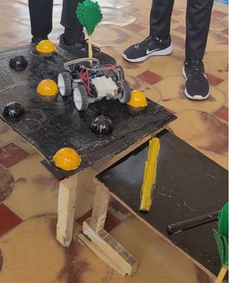

<div align="center">

# 🚗 HIGH-SPEED ROBO CAR

### ⚡ ESP32 • Bluetooth Control • L298N • 300 RPM Motors

<p>
  
  
  
  
</p>

<p>
  <b>A wireless-controlled robotic car built using ESP32 and DC motors.</b>
</p>

<p>
  <a href="#-overview">Overview</a> •
  <a href="#-features">Features</a> •
  <a href="#-hardware">Hardware</a> •
  <a href="#-architecture">Architecture</a> •
  <a href="#-code">Code</a> •
  <a href="#-future-scope">Future Scope</a>
</p>

</div>

---

## 📸 Project Gallery

<div align="center">


<br><br>


<br><br>




</div>

---

# 🚀 Overview

**High-Speed Robo Car** is an academic robotics project developed using an **ESP32 microcontroller**, wireless communication, an **L298N motor driver**, and **four 300 RPM DC motors**.

The ESP32 acts as the main controller of the vehicle. Commands received wirelessly are processed and converted into motor-control signals, allowing the car to move in different directions.

### 🎮 Supported Controls

```text
        ┌─────────────┐
        │   FORWARD   │
        └──────┬──────┘
               │
     ┌─────────┼─────────┐
     ▼         ▼         ▼
   LEFT      STOP      RIGHT
     │                   │
     └─────────┬─────────┘
               ▼
        ┌─────────────┐
        │  BACKWARD   │
        └─────────────┘
