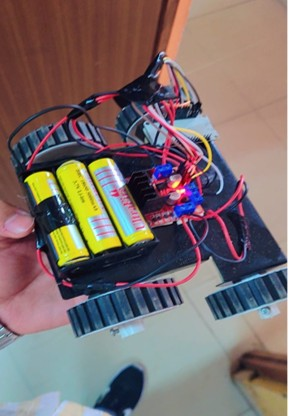
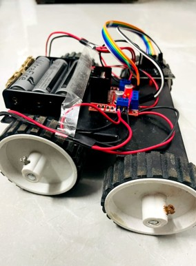
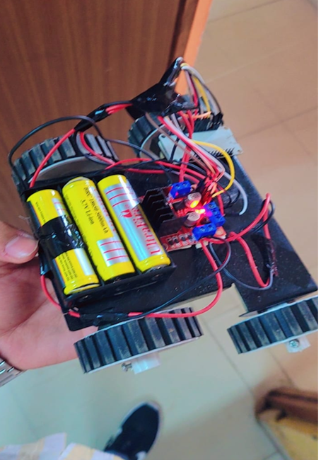
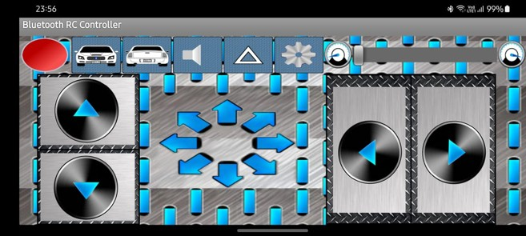

# 🚗 High-Speed Robo Car

A wireless-controlled robotic car built using an **ESP32 microcontroller**, **L298N motor driver**, and **four 300 RPM DC motors**. The project focuses on wireless control, motor control, responsive movement, and a compact robotic vehicle design.

This project was developed as a mini project for the **B.Tech CSE-IoT** program at Lakshmi Narain College of Technology, Bhopal.

---

## 📸 Project Preview

<p align="center">
  
  
</p>

<p align="center">
  
  
</p>

---

## 📌 Project Overview

The **High-Speed Robo Car** is a remotely controlled robotic vehicle designed around the ESP32 microcontroller.

The ESP32 provides wireless communication and acts as the main controller of the robot. Motor control is handled through an **L298N motor driver**, which controls the direction and speed of the DC motors.

The system allows the robotic car to perform basic movements such as:

- Forward
- Backward
- Left
- Right
- Stop

The project also explores the design considerations required for high-speed robotic movement, including stability, power management, wireless communication, and safety.

---

## 🎯 Objectives

The main objectives of this project are:

- Build a wireless-controlled robotic car using ESP32.
- Control the movement of the car remotely.
- Control the speed and direction of the motors.
- Implement forward, backward, left, and right movement.
- Develop a responsive motor-control system.
- Test and calibrate the robotic car for reliable operation.
- Explore future improvements for autonomous navigation and safety.

---

## 🛠️ Hardware Components

| Component | Purpose |
|-----------|---------|
| ESP32 | Main microcontroller and wireless communication |
| L298N Motor Driver | Controls motor direction and speed |
| 300 RPM DC Motors | Drives the robotic car |
| Robot Car Chassis | Mechanical structure |
| Wheels | Provides movement |
| Lithium-Ion Battery | Power supply |
| Voltage Regulator | Provides stable voltage |
| Wireless Controller | Sends movement commands |
| Connecting Wires | Electrical connections |

The project report specifies four 300 RPM DC motors and an L298N/L293D-type motor driver as the primary motor-control hardware. :chatgpt-content-reference{index="2"}

---

## ⚙️ System Architecture

```text
        Smartphone / Remote Controller
                    │
                    │ Wireless Communication
                    ▼
              ┌───────────┐
              │   ESP32   │
              │Controller │
              └─────┬─────┘
                    │
                    │ Motor Control Signals
                    ▼
              ┌───────────┐
              │   L298N   │
              │   Motor   │
              │  Driver   │
              └─────┬─────┘
                    │
          ┌─────────┴─────────┐
          ▼                   ▼
     DC Motors            DC Motors
          │                   │
          └─────────┬─────────┘
                    ▼
               Robot Car
